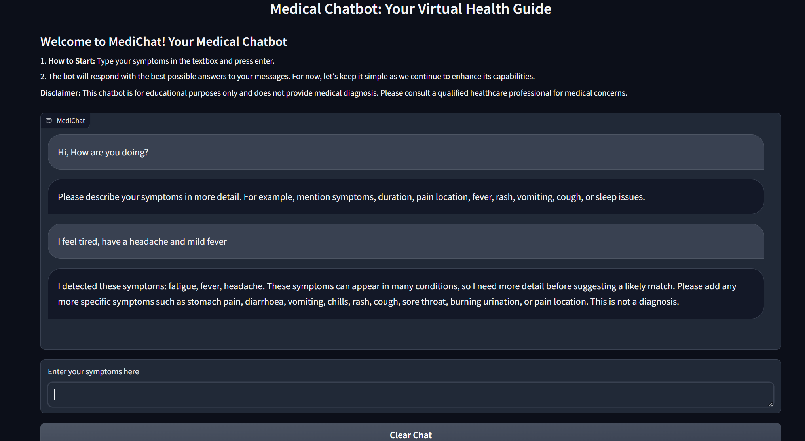
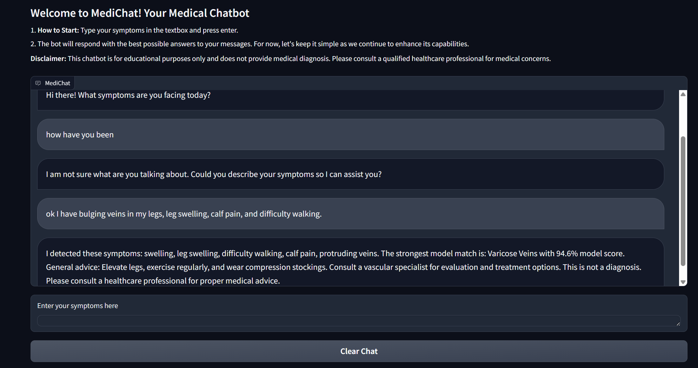
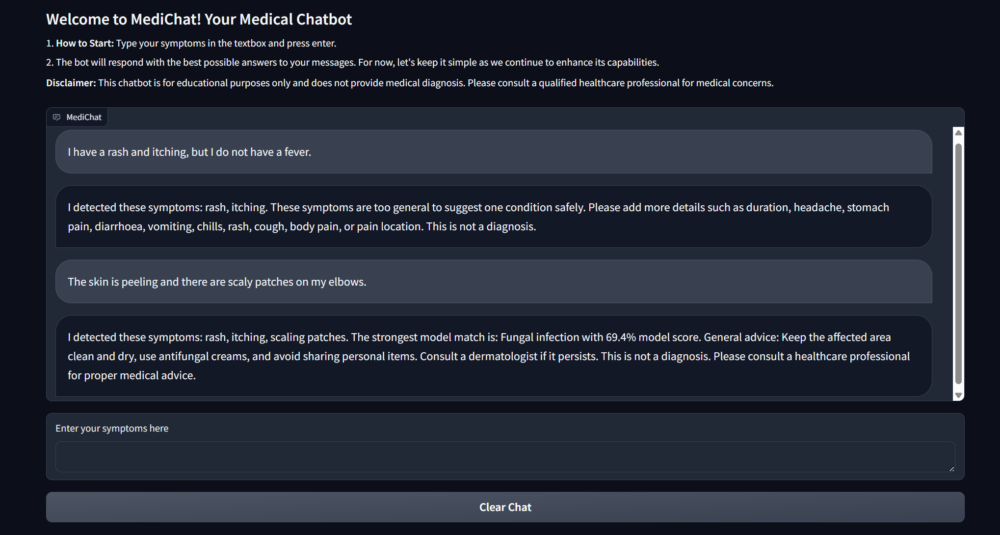

# Medical Symptom Classification Chatbot

This was originally developed as an MSc group project. During testing, I found that the chatbot sometimes returned a condition even when the available symptoms were weak or unclear. I therefore added confidence checks so that it can ask for more information instead of always giving a prediction.

> **Disclaimer:** This is an educational project. It is not a medical device and must not be used for diagnosis or treatment decisions. Always consult a qualified healthcare professional.

---

## Screenshots

**Withholding a prediction when symptoms are too general**



**Asking a follow-up, then committing once there is enough to go on**



**A confident match when the symptoms are specific**



---

## How it works

The chatbot processes each message in three main steps:

1. **Symptom extraction** (`symptom_extractor.py`)
   A keyword dictionary maps ~61 symptoms to their common phrasings ("throwing up", "can't keep food down" → `vomiting`). The extractor handles:
   - **Negation**: "I don't have a fever" does not register as a fever. Clause breaks on *but* / *however* are respected, so "no cough but I have a rash" resolves correctly.
   - **Multi-turn accumulation**: symptoms build up across the conversation, and a later denial retracts an earlier detection.
   - **Gibberish rejection**: inputs with no recognised symptoms or meaningful words are rejected instead of being sent to the classifier.

2. **Classification** (`train_symptom_model.py`)
   Extracted symptoms become a binary feature vector, fed to a `RandomForestClassifier` (100 trees, max depth 20, balanced class weights) trained over 24 conditions.

3. **Confidence gating** (`App.py`)
   Before showing the prediction the app applies several checks. If input is too limited or the model is uncertain, it asks for more information instead:

   | Condition | Behaviour |
   |---|---|
   | Fewer than 3 symptoms detected | Asks for more detail |
   | Only general symptoms (fever, fatigue, nausea, headache…) and confidence < 0.75, or margin < 0.25 | Asks for a distinguishing symptom |
   | Top probability < 0.50, or margin to 2nd place < 0.10 | Shows top 3 with scores instead of a single answer |

---

## Performance

| Metric | Value |
|---|---|
| Classes | 24 |
| Holdout accuracy | ~63% |
| 5-fold CV accuracy | 65% ± 2% |
| Macro F1 | 0.64 |
| Random baseline | ~4% |

Cross-validation over the full dataset; holdout figure from a stratified 15% split.

**Known limitation:** around 17% of training examples produce an empty feature vector, because the keyword dictionary does not yet cover their vocabulary. These are concentrated in a handful of classes (urinary tract infection, psoriasis, hemorrhoids, drug reaction, varicose veins), where recall suffers badly as a result. Expanding the dictionary for these classes should therefore be the first improvement made to the project.

---

## Setup

```bash
git clone https://github.com/Ahmadnawaz27/Medical-Symptom-Chatbot.git
cd Medical-Symptom-Chatbot
pip install -r requirements.txt
```

Train the model (writes `symptom_model.pkl` and `symptom_columns.pkl`):

```bash
python train_symptom_model.py
```

Run the app:

```bash
python App.py
```

Gradio serves the interface at `http://127.0.0.1:7860`.

---

## Project structure

```
App.py                    Gradio interface, conversation state, confidence gating
symptom_extractor.py      Keyword matching, negation handling, symptom formatting
train_symptom_model.py    Feature building and model training
Symptoms.csv              Training data
requirements.txt          Dependencies
```

---

## Data

Trained on the [Symptom2Disease](https://www.kaggle.com/datasets/niyarrbarman/symptom2disease) dataset (1,200 natural-language symptom descriptions across 24 conditions, 50 per class).
I standardised the label casing and removed the non-breaking spaces and curly apostrophes because they caused problems in keyword matching.

---

## Roadmap

- Expand keyword coverage for the five underperforming classes
- Compare the Random Forest model with Logistic Regression and check whether its probability scores work better with current confidence thresholds. 

---

## Context

Built as part of an MSc group project in Applied AI and Data Science. 